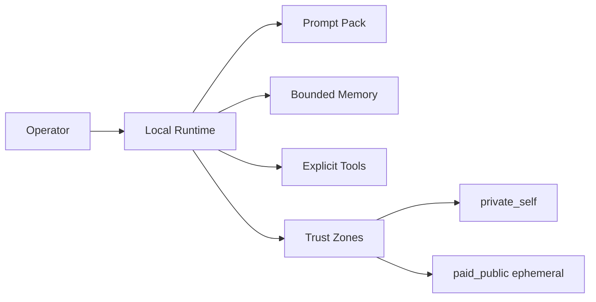

<div align="center">

# Simultech369

**Building local-first agent systems, trust-zone memory, and practical anti-extraction infrastructure.**

<p>
  
  
  
  
</p>

</div>

## Flagship Project

<div align="center">

### [Dizzy: The Polymath](https://github.com/Simultech369/Dizzy-the-Polymath)

**Local-first assistant runtime for bounded memory, trust zones, and accountable continuity.**

<p>
  
  
  
  
</p>

</div>

| Runtime | Safety | Memory | Public Mode |
| --- | --- | --- | --- |
| `/health`, `/prompt`, `/memory/graph` | loopback default, auth gate, rate limiting | scoped retrieval | paid/public ephemeral by default |



## What I Build

- Local-first agent runtimes with explicit trust boundaries
- Memory systems that separate private continuity from public/client surfaces
- Operational readiness gates for APIs, hosting, rate limits, caching, scaling, errors, and accessibility
- Governance and mechanism design for anti-extraction systems
- Practical repo discipline: tests, runbooks, status vocabulary, and launch proof

## Current Focus

- Making Dizzy visually legible and technically credible in public
- Turning readiness requirements into audited project surfaces
- Building systems that prove what runs today before making larger claims

## GitHub Signal

<div align="center">


</div>

<div align="center">


</div>

## Production Readiness Standard

For client-facing or hosted work, I track:

| Area | Gate |
| --- | --- |
| Front end | Minified production build, no secrets, source maps intentionally gated |
| Database | RLS or tenant isolation on authenticated reads/writes |
| Version control | Protected main, reviewed deploy commits, tagged releases |
| APIs | Auth, validation, CORS, request limits, structured errors |
| Hosting | HTTPS, least-privilege env vars, health checks, rollback path |
| Rate limiting | Per-user or per-IP limits on public/expensive routes |
| Caching | Static assets cached, sensitive responses protected |
| Scaling | Queue/backpressure and outage behavior documented |
| Error tracking | Scrubbed server/client errors with release context |
| Accessibility | WCAG 2.2 AA target; at least WCAG 2.1 AA where required |

## Useful Links

- [Dizzy: The Polymath](https://github.com/Simultech369/Dizzy-the-Polymath)
- [Production readiness gate](https://github.com/Simultech369/Dizzy-the-Polymath/blob/main/PRODUCTION_READINESS.md)
- [Repo guide](https://github.com/Simultech369/Dizzy-the-Polymath/blob/main/REPO_GUIDE.md)

```text
Meme:
Vibe: architect of post-extraction cognitive infrastructure
Evidence: tests, runtime endpoints, readiness gates, and receipts
```
