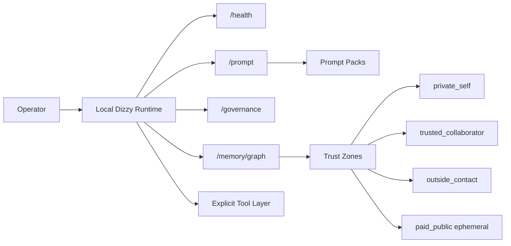

# Dizzy

<div align="center">


**Local-first assistant runtime for bounded memory, trust zones, and accountable continuity.**

<p>
  
  
  
  
  
  
  
</p>

> **Quickstart Guide**: See [QUICKSTART.md](QUICKSTART.md) for the **"Try Dizzy in 5 Minutes"** guided walk-through (`/health` + `/prompt`), trust-zone demo, and visual identity map.

</div>

### Repository Structure and Authority

| Layer | Path / Files | Authority Status |
| --- | --- | --- |
| **Runtime** | `agent_server.mjs`, `worker.mjs`, `lib/` | Active, tested execution layer |
| **Experimental** | `lib/sqlite_operational_store.mjs` | Retained as experimental sidecar, Node 22+ tested |
| **Doctrine** | `CONSTITUTION.md`, `PROMPT_CORE.md`, `identity/` | High authority, governs prompt packs and boundaries |
| **Prototypes** | `core/prototypes/` | Reference only, non-authoritative cross-language sketches |

Dizzy is a local-first continuity-and-judgment runtime. It helps an operator preserve orientation, apply judgment under uncertainty, and carry forward only the context that improves present agency.

The repo is transparent without turning every working note into doctrine: the runtime is small and bounded; the surrounding documents show how its judgment loop, memory rules, and public/private trust boundaries are being refined.

## What Runs Today

| Surface | Current evidence / check |
| --- | --- |
| Local HTTP runtime | `/health`, `/prompt`, `/governance`, plus opt-in `/memory/graph` |
| Prompt governance | Prompt sources are loaded through a scoped bundle and budget checks |
| Bounded memory | Retrieval is scoped by trust zone and allowed surfaces |
| Paid/public mode | Defaults to ephemeral continuity unless explicitly enabled |
| Safety checks | `npm test`, `npm run smoke`, `npm run check:state` |

## Runtime Shape



## Quick Start

Install dependencies:

```powershell
npm install
```

The main runtime supports Node.js 20.18.1+. The full safety suite also requires Python 3 for the OpenRouter review-tool checks. The experimental SQLite operational-store acceptance checks run only on Node.js 22.5+ because they use the optional built-in `node:sqlite` module.

Run the server:

```powershell
node .\agent_server.mjs
```

To expose the local memory graph for an operator session, set `DIZZY_MEMORY_GRAPH_ENABLED=1` before starting the server. It is disabled by default and remote access still requires runtime authentication.

In another terminal, inspect the local runtime:

```powershell
Invoke-RestMethod http://127.0.0.1:3000/health
Invoke-RestMethod http://127.0.0.1:3000/prompt
# Available only when DIZZY_MEMORY_GRAPH_ENABLED=1:
Invoke-RestMethod http://127.0.0.1:3000/memory/graph
```

Run verification:

```powershell
npm test
npm run smoke
npm run check:state
```

For Telegram, model backends, Redis, workers, and optional marketplace surfaces, see [`RUNBOOK.md`](RUNBOOK.md).

For a guided map of the repo, see [`REPO_GUIDE.md`](REPO_GUIDE.md).

## What This Is

- A local-first runtime for a continuity-aware assistant
- A doctrine + runtime repo where the constitutional layer is explicit
- A system with trust zones, retention boundaries, and operator-mediated public surfaces
- A working codebase with health, prompt, governance, memory, queue, and tool infrastructure

## What This Is Not

- A finished commercial product
- A turnkey hosted service
- A general claim that the political-economic conditions described in the docs already exist
- A public ontology-performance project

The public or paid layer is currently a constrained projection of the core system and remains operator-mediated.

## Current Status

- Local-first runtime works
- Governance and prompt-pack architecture are implemented
- Paid/public mode defaults to ephemeral continuity unless explicitly enabled per client/task
- Automatic markdown retrieval is scoped to trusted doctrine docs plus `memory/`
- Marketplace/public endpoints are informational and informal, not a mature storefront contract

## Repo Map

| File | Role |
| --- | --- |
| [`DESIGN.md`](DESIGN.md) | Human canonical source of truth |
| [`INTERACTION_NORMS.md`](INTERACTION_NORMS.md) | Plain-language interaction and governance summary |
| [`PROMPT_CORE.md`](PROMPT_CORE.md) | Live behavioral core |
| [`PROMPT_PACKS.md`](PROMPT_PACKS.md) | Prompt-pack model |
| [`RUNBOOK.md`](RUNBOOK.md) | Local setup and operational notes |
| [`REPO_GUIDE.md`](REPO_GUIDE.md) | Guided map for first-time readers and maintainers |
| [`FILE_ROLES.md`](FILE_ROLES.md) | Root-file authority and role map |
| [`MECHANISMS.md`](MECHANISMS.md) | Reusable design mechanisms in the repo |
| [`CHOKEPOINTS.md`](CHOKEPOINTS.md) | Self-inspection map for dependency, capture, and exit risks |
| [`OPERATING_LOOP.md`](OPERATING_LOOP.md) | Daily operator loop for turning work into durable value |
| [`OPERATIONS.md`](OPERATIONS.md) | Runtime execution overlay |
| [`MECHANISM_SIEVE.md`](MECHANISM_SIEVE.md) | Worksheet for converting values into mechanisms |
| [`PORTABILITY.md`](PORTABILITY.md) | Export, deletion, and trust-zone boundaries for continuity records |
| [`OPERATING_SURFACE.md`](OPERATING_SURFACE.md) | Optional lightweight outward-facing surface |
| [`upgrades/`](upgrades/) | Planning lane, review trail, and candidate improvements; not runtime doctrine |

## Trust Zones And Retention

Dizzy uses trust zones as real runtime boundaries:

| Zone | Default continuity posture |
| --- | --- |
| `private_self` | Retained continuity and durable memory allowed |
| `trusted_collaborator` | Selective continuity, narrower disclosure |
| `outside_contact` | Fresh-context reasoning by default |
| `paid_public` | Ephemeral by default; continuity only when explicitly enabled per client/task |

Retention is intentional and local-first, not ambient.

## Safety Posture

- Loopback bind by default
- Optional bearer auth for non-loopback exposure
- Remote mutations disabled by default
- Self-modification disabled by default
- Explicit external-tool invocation only
- Auto-retrieval scoped to trusted doctrine and memory surfaces

## Political-Economic Direction

The repo carries a political-economic direction centered on anti-extraction, capability, and bounded governance. That direction should be read as orientation for construction, not as a claim that current conditions have already achieved it.

## Status Vocabulary

- `runtime-enforced`: implemented in code, tests, or machine-facing behavior
- `constitutional`: live prompt-pack or governing doctrine that shapes default behavior
- `operator overlay`: operational practice or manual boundary, not fully automated
- `planning candidate`: proposal under review in `upgrades/`
- `historical provenance`: retained context for audit, not an active recommendation
- `deprecated`: kept only to explain what should not guide future work

## Visual Upgrades To Add When Public

These are free and easy, but should be added only when the public account/repo details are ready:

- GitHub Actions status badge for the verification workflow
- Profile README surface in [`PROFILE_README.md`](PROFILE_README.md) for `Simultech369/Simultech369`
- Public demo GIF showing `/health`, `/prompt`, and an explicitly enabled local `/memory/graph`
- GitHub Readme Stats card for the operator/profile README
- GitHub Profile Trophy card for the profile README
- Contribution graph animation for the profile README
- Pinned project grid linking Dizzy, Pharmacy Fiduciary Commons, and any bounty/client work that is safe to show

## Production Readiness Checklist

This is the minimum bar before any hosted or client-facing surface should be treated as production-ready.

The integrated project gate lives in [`PRODUCTION_READINESS.md`](PRODUCTION_READINESS.md) and is checked by:

```powershell
npm run check:production
npm run check:dependencies
```

Use [`EXTERNAL_SURFACE_REVIEW.md`](EXTERNAL_SURFACE_REVIEW.md) before adding any public form, auth provider, edge provider, hosted database, or client-facing storage.

| Area | Requirement |
| --- | --- |
| Minified front end | Production build uses minified assets, no exposed secrets, no public source maps unless intentionally gated, and no environment variables shipped into client bundles unless safe for public use |
| Database | Row-level security is enabled where supported, every authenticated read/write path is scoped to the current user or tenant, and service-role credentials never touch the browser |
| Version control | Main branch is protected, releases are tagged, secrets are excluded from git history, and deploys come from reviewed commits |
| APIs | Auth, input validation, schema checks, CORS policy, request size limits, structured errors, and explicit public/private route boundaries are in place |
| Hosting and deployment | Deploy target uses HTTPS, least-privilege environment variables, rollback path, health checks, and separate development/staging/production configuration |
| External intake and providers | Public forms, auth providers, hosted databases, edge providers, and storage providers are scoped adapters with documented purpose, collected fields, destination, retention, deletion/export path, logging posture, and secret boundary |
| Rate limiting | Public, auth, and expensive routes have per-IP or per-user limits; abuse limits fail closed without leaking private state |
| Caching | Static assets are cacheable, sensitive responses are not cached publicly, and cache invalidation is explicit for user-specific data |
| Scaling | Runtime has documented resource assumptions, queue/backpressure behavior, horizontal-scaling constraints, and failure modes for Redis/database/provider outages |
| Dependency/API drift | Dependency, lockfile, runtime, provider, and external API contract changes are classified before promotion; provider keys stay in environment variables, not CLI args |
| Error tracking | Server and client errors are captured with environment, release, and request context, while secrets and private user content are scrubbed |
| Accessibility / ADA | Public UI targets WCAG 2.2 AA; legal/procurement-sensitive surfaces verify at least WCAG 2.1 AA, with keyboard navigation, semantic HTML, labels, focus states, contrast, alt text, reduced-motion support, and screen-reader checks |

## Launch Proof To Capture

- Screenshot or GIF of the production build running
- `/health` response from the deployed target
- Passing test output from the release commit
- Accessibility scan results plus one manual keyboard/screen-reader pass
- Rate-limit behavior shown on one public route
- Error-tracking dashboard receiving a test event
- External intake/provider data-flow map if any form, auth provider, edge provider, hosted database, or client-facing storage is added
- Database RLS policy notes or migration references
- Deployment rollback command or provider rollback path

## Notes

This repository is intentionally legible about what is implemented, what is operator-mediated, and what remains provisional. If a public surface overclaims maturity, correct the claim rather than decorating it.
