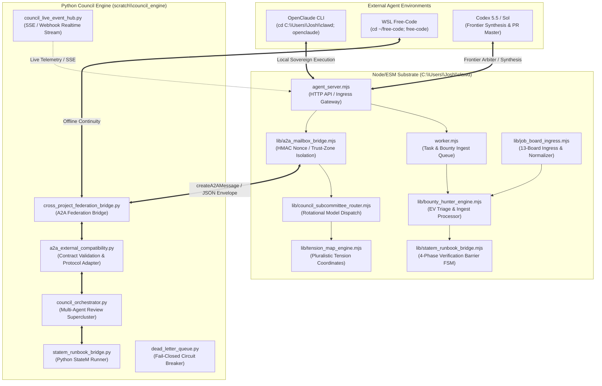
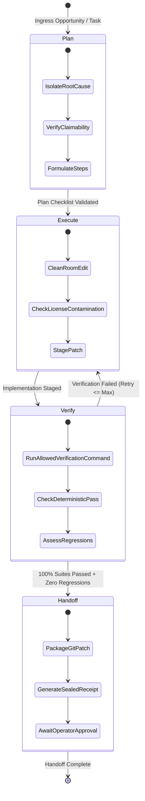

# Dizzy Council Specialization & Cross-Substrate Handoff

**Snapshot Date**: 2026-08-27  
**Primary Substrates**: 
- **Node/ESM Host**: `C:\Users\Josh\clawd\` (Simultech369 / Dizzy-the-Polymath)
- **Python Council Engine**: `C:\Users\Josh\.gemini\antigravity\scratch\council_engine\`
- **Terminal Execution Environments**:
  - Windows Host: `cd C:\Users\Josh\clawd; openclaude`
  - WSL Host: `cd ~/free-code; free-code`

---

## Architecture & Substrate Federation



---

## Council Best Practices & Governance Rules

### 1. Trust-Zone Isolation
- **Strict Boundary Separation**: The `private_self` trust domain (containing operator journals, raw thoughts, and internal keys) must **never** cross into `outside_contact`, `operator_bounded`, or external A2A envelopes.
- **Sealed Envelope Serialization**: All inter-agent and cross-substrate communications must be constructed via `createA2AMessage` / `createBountyA2AIngestEnvelope` with:
  - Cryptographic nonces (`node:crypto.randomBytes`)
  - Timestamp bounding (`ingested_at`, `created_at`)
  - Canonical payload SHA-256 digests
  - Stripped private memory trees (`memory/` and `.env` references filtered closed)

### 2. Pluralistic Tension Coordinates
- **Anti-Echo-Chamber Vectoring**: Review synthesis does not average out disagreement; it projects reviewer stances across 4 fundamental dialectical axes:
  1. **Elegance vs. Durability**: Minimal aesthetic code vs. defensive, redundant hardening.
  2. **Autonomy vs. Supervision**: Unattended self-healing execution vs. explicit operator gates.
  3. **Speed vs. Rigor**: Rapid iterative prototyping vs. formal verification and fuzzing.
  4. **Innovation vs. Continuity**: Paradigm shifts vs. backward compatibility and zero API churn.
- **Centroid & Variance**: Calculated by `buildTensionMap()` in [`lib/tension_map_engine.mjs`](file:///C:/Users/Josh/clawd/lib/tension_map_engine.mjs) and rendered as live SVG vector maps via `renderTensionMapSvg()`.

### 3. Fail-Closed Circuit Breakers
- **Backpressure & Quarantine**: Monitored by `lib/circuit_breaker.mjs` and `dead_letter_queue.py`.
- **Thresholds**:
  - Error rate spikes exceeding **5 consecutive failures** trigger immediate circuit opening.
  - Token drift or runaway loops abort execution before state corruption.
  - Dead-letter queue captures malformed payloads for post-mortem operator audit without crashing worker processes.

---

## Agent & Model Rotations

```mermaid
graph LR
    subgraph Layer_Local["1. Local Sovereign Tier (Zero Cost / High Privacy)"]
        L1["openclaude\n(Local Terminal Interface)"]
        L2["zero / llama3.1:8b\n(Syntax & Sandbox Sanitizer)"]
        L3["qwen2.5-coder:7b / 32b\n(AST & Clean-Room Generation)"]
    end

    subgraph Layer_Supervision["2. Review Loop Supervisor Tier"]
        S1["council_subcommittee_router.mjs\n(Dynamic Rotational Dispatcher)"]
        S2["agent_server.mjs\n(Stateful Session & Replay Store)"]
        S3["statem_runbook_bridge.mjs\n(4-Phase Verification Barrier)"]
    end

    subgraph Layer_Adversarial["3. Adversarial & SRE Tier"]
        A1["deepseek-r1\n(Deep Reasoner / Fault Injector)"]
        A2["ai_sre_diagnose.mjs\n(Root Cause Analysis & Deadlock Detection)"]
        A3["anti_slop_scanner.mjs\n(Prose & Code Purity Enforcer)"]
    end

    subgraph Layer_Frontier["4. Frontier Arbiter Tier"]
        F1["codex-5.5 / Sol\n(Long-Horizon Synthesis & Handoff)"]
        F2["antigravity-flash / pro\n(Agentic Pair Programming & Tool Orchestration)"]
    end

    Layer_Local --> Layer_Supervision
    Layer_Supervision --> Layer_Adversarial
    Layer_Adversarial --> Layer_Frontier
    Layer_Frontier -. "Sealed Handoff Receipts" .-> Layer_Local
```



| Role | Primary Models / Subsystems | Primary Responsibilities |
| :--- | :--- | :--- |
| **Local Sovereign Executor** | `openclaude`, `zero` (`llama3.1:8b`, `qwen2.5-coder:7b/32b`) | Zero-cost local evaluation, syntax verification, AST hygiene, privacy-first local file operations. |
| **Review Loop Supervisor** | `council_subcommittee_router.mjs`, `agent_server.mjs`, `review_cycle_orchestrator.mjs` | Multi-round review scheduling, state tracking, pluralistic tension variance evaluation, deterministic test execution. |
| **Adversarial SRE** | `deepseek-r1`, `ai_sre_diagnose.mjs`, `lib/adversarial_verification_harness.mjs` | Reentrancy fuzzing, edge-case analysis, anti-slop enforcement, boundary leak penetration tests. |
| **Frontier Arbiter** | `codex-5.5`, `antigravity` (Gemini 2.5 Flash / Pro) | High-level synthesis, cross-codebase federation, PR descriptions, architectural decisions, final audit sealing. |

---

## 4-Phase StateM Bounty Hunter & Execution Lifecycle



---

## Key Copy-Paste File Paths

### Node/ESM Host Runtime (`C:\Users\Josh\clawd\`)
```text
C:\Users\Josh\clawd\lib\a2a_mailbox_bridge.mjs
C:\Users\Josh\clawd\scripts\a2a_mailbox_bridge_test.mjs
C:\Users\Josh\clawd\lib\tension_map_engine.mjs
C:\Users\Josh\clawd\lib\council_subcommittee_router.mjs
C:\Users\Josh\clawd\agent_server.mjs
C:\Users\Josh\clawd\dizzy_poll_deliver.mjs
C:\Users\Josh\clawd\smoke_test.mjs
C:\Users\Josh\clawd\reviews\hmi_hud_layout_spec.md
C:\Users\Josh\clawd\lib\bounty_hunter_engine.mjs
C:\Users\Josh\clawd\scripts\bounty_hunter_engine_test.mjs
C:\Users\Josh\clawd\lib\job_board_ingress.mjs
C:\Users\Josh\clawd\scripts\job_board_and_tension_map_test.mjs
C:\Users\Josh\clawd\lib\statem_runbook_bridge.mjs
C:\Users\Josh\clawd\scripts\statem_runbook_bridge_test.mjs
C:\Users\Josh\clawd\UNIFIED_HANDOFF_PACKET.md
C:\Users\Josh\clawd\reviews\oss_council_verdict_latest.json
```

### Python Council Engine (`C:\Users\Josh\.gemini\antigravity\scratch\council_engine\`)
```text
C:\Users\Josh\.gemini\antigravity\scratch\council_engine\cross_project_federation_bridge.py
C:\Users\Josh\.gemini\antigravity\scratch\council_engine\a2a_external_compatibility.py
C:\Users\Josh\.gemini\antigravity\scratch\council_engine\council_live_event_hub.py
C:\Users\Josh\.gemini\antigravity\scratch\council_engine\council_api_server.py
C:\Users\Josh\.gemini\antigravity\scratch\council_engine\council_orchestrator.py
C:\Users\Josh\.gemini\antigravity\scratch\council_engine\statem_runbook_bridge.py
C:\Users\Josh\.gemini\antigravity\scratch\council_engine\dead_letter_queue.py
```

---

## Live Verification Proof Baseline

```text
Receipt: reviews\oss_council_verdict_latest.json
Timestamp: 2026-08-27T12:12:08.228Z
Verdict: VERIFIED_PASSED
Syntax Targets: 103 (100% Passed)
Execution Suites: 50 (100% Passed)
Governance Checks: 2 (100% Passed)
SHA-256: 7A971C4C43E760E24348E7E01D9F56F598471B63F1EC21F47F7C689C1EE0EA73
```
