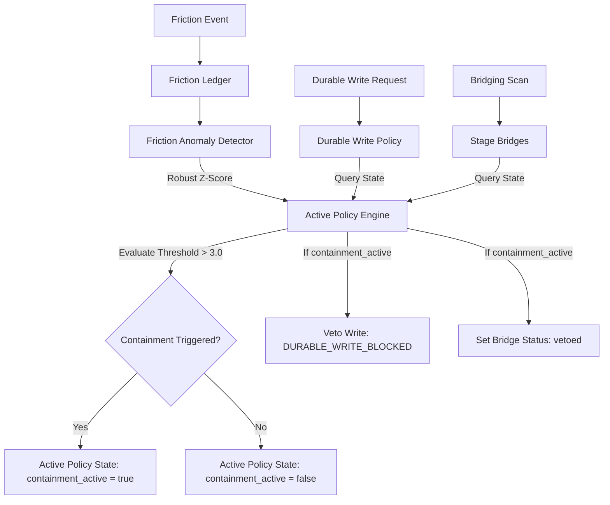

# Active Policy Engine Specification

**Author:** Policy Engine Architect (Seed-2.1-Pro)  
**Date:** July 17, 2026  
**Target:** Active Containment & Safe Fallback Protocols  
**Status:** Draft / Specification  

---

## 1. Architectural Overview

The **Active Policy Engine** provides automated, real-time safety containment for the Dizzy cognitive engine. By monitoring system friction metrics logged in the Friction Ledger, the engine computes a robust Z-score using Median Absolute Deviation (MAD). When statistical anomalies exceed a safety threshold (Robust Z-score > 3.0), the engine immediately triggers containment protocols:
1. **Bridge Containment**: Automatically vetoes newly staged and existing quarantined bridges to prevent incorrect associative mergers.
2. **Write Suspension**: Disables durable filesystem modifications via `lib/durable_write_policy.mjs` to prevent cascading state corruption.

### 1.1. Data Flow & Interception Model

The diagram below illustrates how the Policy Engine acts as a gatekeeper across the system:



---

## 2. JSON Schema Specifications

The Policy Engine operates on two primary JSON structures: the **Configuration Schema** (defining rules, thresholds, and limits) and the **State Schema** (tracking current containment status and execution history).

### 2.1. Active Policy Configuration Schema (`active-policy-config.json`)

```json
{
  "$schema": "http://json-schema.org/draft-07/schema#",
  "title": "ActivePolicyConfig",
  "description": "Configuration rules for triggering safety containment based on system friction.",
  "type": "object",
  "properties": {
    "enabled": {
      "type": "boolean",
      "description": "Enables or disables the Active Policy Engine.",
      "default": true
    },
    "z_score_threshold": {
      "type": "number",
      "description": "Robust Z-score threshold above which containment triggers.",
      "minimum": 0.0,
      "default": 3.0
    },
    "min_history_entries": {
      "type": "integer",
      "description": "Minimum historical ledger entries required to evaluate policies.",
      "minimum": 5,
      "default": 5
    },
    "containment_actions": {
      "type": "object",
      "properties": {
        "suspend_durable_writes": {
          "type": "boolean",
          "description": "If true, durable writes are blocked under containment.",
          "default": true
        },
        "veto_quarantined_bridges": {
          "type": "boolean",
          "description": "If true, quarantined bridges are set to 'vetoed' under containment.",
          "default": true
        }
      },
      "required": ["suspend_durable_writes", "veto_quarantined_bridges"]
    },
    "escalation_contact": {
      "type": "string",
      "description": "Operator alert channel or address for containment warnings.",
      "default": "operator@localhost"
    }
  },
  "required": ["enabled", "z_score_threshold", "min_history_entries", "containment_actions"]
}
```

### 2.2. Active Policy State Schema (`active-policy-state.json`)

```json
{
  "$schema": "http://json-schema.org/draft-07/schema#",
  "title": "ActivePolicyState",
  "description": "Runtime status log tracking active containments and the latest statistical values.",
  "type": "object",
  "properties": {
    "last_evaluated_at": {
      "type": "string",
      "format": "date-time",
      "description": "ISO timestamp of the last policy run."
    },
    "containment_active": {
      "type": "boolean",
      "description": "Indicates if safety containment is currently engaged.",
      "default": false
    },
    "trigger_reason": {
      "type": "string",
      "description": "Details about the specific anomaly that triggered containment.",
      "nullable": true
    },
    "latest_metrics": {
      "type": "object",
      "properties": {
        "robust_z": {
          "type": "number",
          "description": "The robust Z-score computed during the last run."
        },
        "median": {
          "type": "number",
          "description": "Friction weight median."
        },
        "mad": {
          "type": "number",
          "description": "Median Absolute Deviation."
        },
        "scale": {
          "type": "number",
          "description": "Scaling factor used in Z-score computation."
        }
      },
      "required": ["robust_z", "median", "mad", "scale"]
    },
    "containment_history": {
      "type": "array",
      "items": {
        "type": "object",
        "properties": {
          "triggered_at": { "type": "string", "format": "date-time" },
          "resolved_at": { "type": "string", "format": "date-time", "nullable": true },
          "trigger_z": { "type": "number" },
          "friction_type": { "type": "string" },
          "resolved_by_operator": { "type": "boolean" }
        },
        "required": ["triggered_at", "trigger_z", "friction_type"]
      }
    }
  },
  "required": ["last_evaluated_at", "containment_active", "latest_metrics", "containment_history"]
}
```

---

## 3. JavaScript Logic

The implementation is structured as a class `ActivePolicyEngine` residing in `lib/active_policy_engine.mjs`. It reads configurations, parses the friction ledger, calculates robust stats using Median Absolute Deviation (MAD), and manages containment state persistence.

### 3.1. Engine Implementation (`lib/active_policy_engine.mjs`)

```javascript
/**
 * lib/active_policy_engine.mjs
 * ----------------------------
 * Active Policy Engine for Dizzy.
 * Computes robust Z-scores from the friction ledger and manages containment status.
 */

import fs from "fs";
import path from "path";
import { detectFrictionAnomaly } from "./friction_anomaly_detector.mjs";
import { readFrictionEntriesSync } from "./friction_ledger.mjs";

const DEFAULT_CONFIG_PATH = path.resolve(process.cwd(), "runtime", "active_policy_config.json");
const DEFAULT_STATE_PATH = path.resolve(process.cwd(), "runtime", "active_policy_state.json");

export class ActivePolicyEngine {
  constructor(opts = {}) {
    this.configPath = opts.configPath || DEFAULT_CONFIG_PATH;
    this.statePath = opts.statePath || DEFAULT_STATE_PATH;
    this.config = this.loadConfig();
    this.state = this.loadState();
  }

  loadConfig() {
    try {
      if (fs.existsSync(this.configPath)) {
        return JSON.parse(fs.readFileSync(this.configPath, "utf8"));
      }
    } catch (e) {
      console.warn(`[policy_engine] Failed to load config: ${e.message}. Using defaults.`);
    }
    return {
      enabled: true,
      z_score_threshold: 3.0,
      min_history_entries: 5,
      containment_actions: {
        suspend_durable_writes: true,
        veto_quarantined_bridges: true
      },
      escalation_contact: "operator@localhost"
    };
  }

  loadState() {
    try {
      if (fs.existsSync(this.statePath)) {
        return JSON.parse(fs.readFileSync(this.statePath, "utf8"));
      }
    } catch (e) {
      console.warn(`[policy_engine] Failed to load state: ${e.message}. Initializing empty.`);
    }
    return {
      last_evaluated_at: new Date().toISOString(),
      containment_active: false,
      trigger_reason: null,
      latest_metrics: { robust_z: 0, median: 0, mad: 0, scale: 0.1 },
      containment_history: []
    };
  }

  saveState() {
    try {
      const dir = path.dirname(this.statePath);
      if (!fs.existsSync(dir)) {
        fs.mkdirSync(dir, { recursive: true });
      }
      fs.writeFileSync(this.statePath, JSON.stringify(this.state, null, 2), "utf8");
    } catch (e) {
      console.error(`[policy_engine] Failed to save state: ${e.message}`);
    }
  }

  /**
   * Evaluate policy rules against a newly recorded friction entry
   * @param {Object} newFrictionEntry - The newly added friction log
   * @param {Array} historyOverride - Optional historical logs (for testing)
   */
  evaluate(newFrictionEntry, historyOverride = null) {
    if (!this.config.enabled) {
      return this.state;
    }

    const history = historyOverride || readFrictionEntriesSync() || [];
    const report = detectFrictionAnomaly(history, newFrictionEntry);

    this.state.last_evaluated_at = new Date().toISOString();
    this.state.latest_metrics = {
      robust_z: report.robust_z,
      median: report.median,
      mad: report.mad,
      scale: report.scale
    };

    const threshold = this.config.z_score_threshold;
    if (report.robust_z >= threshold) {
      // Containment triggered
      if (!this.state.containment_active) {
        this.state.containment_active = true;
        this.state.trigger_reason = `Friction anomaly detected: Robust Z-score ${report.robust_z} >= threshold ${threshold}. Type: "${newFrictionEntry.friction_type}"`;
        
        // Log to containment history
        this.state.containment_history.push({
          triggered_at: new Date().toISOString(),
          resolved_at: null,
          trigger_z: report.robust_z,
          friction_type: newFrictionEntry.friction_type,
          resolved_by_operator: false
        });

        // Trigger side-effect actions (like bridge vetoing)
        if (this.config.containment_actions.veto_quarantined_bridges) {
          this.vetoQuarantinedBridges();
        }
      }
    }

    this.saveState();
    return this.state;
  }

  /**
   * Scan the quarantine directory and transition all non-approved bridges to "vetoed"
   */
  vetoQuarantinedBridges() {
    const quarantineDir = path.resolve(process.cwd(), "runtime", "quarantine");
    if (!fs.existsSync(quarantineDir)) return;

    try {
      const files = fs.readdirSync(quarantineDir).filter(f => f.startsWith("bridge_") && f.endsWith(".json"));
      for (const file of files) {
        const filePath = path.join(quarantineDir, file);
        const bridge = JSON.parse(fs.readFileSync(filePath, "utf8"));
        
        if (!bridge.approved_by_operator && bridge.status !== "vetoed") {
          bridge.status = "vetoed";
          bridge.vetoed_at = new Date().toISOString();
          bridge.veto_reason = `Active Policy Engine containment active (Z-score anomaly).`;
          fs.writeFileSync(filePath, JSON.stringify(bridge, null, 2), "utf8");
          console.log(`[policy_engine] Quarantined bridge ${bridge.id} has been VETOED.`);
        }
      }
    } catch (e) {
      console.error(`[policy_engine] Failed to veto quarantined bridges: ${e.message}`);
    }
  }

  /**
   * Manually resolve containment status (Operator override)
   */
  resolveContainment() {
    if (this.state.containment_active) {
      this.state.containment_active = false;
      this.state.trigger_reason = null;
      
      const lastHistory = this.state.containment_history[this.state.containment_history.length - 1];
      if (lastHistory && !lastHistory.resolved_at) {
        lastHistory.resolved_at = new Date().toISOString();
        lastHistory.resolved_by_operator = true;
      }
      this.saveState();
      console.log(`[policy_engine] Active containment has been manually resolved by the operator.`);
    }
  }

  /**
   * Check if durable write capabilities are suspended
   */
  isWriteSuspended() {
    return this.config.enabled && 
           this.state.containment_active && 
           this.config.containment_actions.suspend_durable_writes;
  }

  /**
   * Check if quarantined bridge submissions are vetoed
   */
  isBridgeVetoActive() {
    return this.config.enabled && 
           this.state.containment_active && 
           this.config.containment_actions.veto_quarantined_bridges;
  }
}
```

---

## 4. System Integration Diffs

To activate the policy check runtime interception, apply changes to `lib/durable_write_policy.mjs` and `lib/bridging_scan.mjs`.

### 4.1. Durable Write Interception (`lib/durable_write_policy.mjs`)

Interpose a pre-flight containment check at the entry of write authorization:

```diff
--- <local-clawd-checkout>\lib\durable_write_policy.mjs
+++ <local-clawd-checkout>\lib\durable_write_policy.mjs
@@ -3,6 +3,7 @@
 import { assessCaptureEligibility } from "./capture_eligibility.mjs";
+import { ActivePolicyEngine } from "./active_policy_engine.mjs";
 
 const ALLOWED_DURABLE_ZONES = new Set(["private_self", "trusted_collaborator"]);
+const policyEngine = new ActivePolicyEngine();
 
@@ -121,6 +122,10 @@
 export function assessDurableWrite(input = {}) {
   const kind = String(input.kind || "durable_memory").trim() || "durable_memory";
   const trustZone = String(input.trustZone || "private_self").trim().toLowerCase();
   const sensitivity = String(input.sensitivityClass || input.payload?.sensitivity_class || "normal").trim().toLowerCase();
   const raw = payloadText(input.payload);
 
+  if (policyEngine.isWriteSuspended()) {
+    return { allowed: false, reason: "write_capabilities_suspended_containment_active", kind, trust_zone: trustZone };
+  }
+
   if (!ALLOWED_DURABLE_ZONES.has(trustZone)) {
```

### 4.2. Bridging Scan Auto-Veto Integration (`lib/bridging_scan.mjs`)

Enforce automatic veto assignment for staged quarantine suggestions when the anomaly flag is raised:

```diff
--- <local-clawd-checkout>\lib\bridging_scan.mjs
+++ <local-clawd-checkout>\lib\bridging_scan.mjs
@@ -10,6 +10,7 @@
 import path from "path";
 import crypto from "crypto";
+import { ActivePolicyEngine } from "./active_policy_engine.mjs";
 
+const policyEngine = new ActivePolicyEngine();
 
@@ -124,5 +125,5 @@
     let approved = false;
-    let status = "quarantined";
+    let status = policyEngine.isBridgeVetoActive() ? "vetoed" : "quarantined";
     let approvedBy = null;
     let approvedAt = null;
 
@@ -141,5 +142,9 @@
       approved_by_operator: approved,
       status: status,
     };
+    if (status === "vetoed") {
+      payload.vetoed_at = new Date().toISOString();
+      payload.veto_reason = "Active Policy Engine containment active (Z-score anomaly).";
+    }
     if (approvedBy) payload.operator_approved_by = approvedBy;
     if (approvedAt) payload.operator_approved_at = approvedAt;
```

### 4.3. Ledger Append Integration (`lib/friction_ledger.mjs`)

When new friction is logged, automatically trigger the evaluation of the Active Policy Engine:

```diff
--- <local-clawd-checkout>\lib\friction_ledger.mjs
+++ <local-clawd-checkout>\lib\friction_ledger.mjs
@@ -4,4 +4,5 @@
 import { assertDurableWriteAllowed } from "./durable_write_policy.mjs";
+import { ActivePolicyEngine } from "./active_policy_engine.mjs";
 
+const policyEngine = new ActivePolicyEngine();
 
@@ -96,4 +97,6 @@
   fs.appendFileSync(filePath, `${JSON.stringify(entry)}\n`, "utf8");
+  try {
+    policyEngine.evaluate(entry);
+  } catch (e) {
+    console.error(`[friction_ledger] Policy engine evaluation error: ${e.message}`);
+  }
   return { entry, filePath };
 }
@@ -171,4 +174,10 @@
   await fs.promises.appendFile(filePath, `${JSON.stringify(entry)}\n`, "utf8");
+  try {
+    policyEngine.evaluate(entry);
+  } catch (e) {
+    console.error(`[friction_ledger] Policy engine evaluation error: ${e.message}`);
+  }
   return { entry, filePath };
 }
```

---

## 6. Verification Plan

To test containment transitions, execute the following script (saved to `scratch/test_containment.mjs`):

1. **Phase 1 (Baseline)**: Add 5 normal friction entries (weight = 2) to build a stable historical median.
2. **Phase 2 (Anomaly)**: Submit a high-weight chronic friction entry (severity = 10, multiplier = 3, weight = 30).
3. **Phase 3 (Enforcement Verification)**:
   - Verify `active_policy_state.json` has `containment_active: true`.
   - Verify staging a new bridge labels it `status: "vetoed"`.
   - Verify writing via `assertDurableWriteAllowed` throws a `DURABLE_WRITE_BLOCKED` error.
