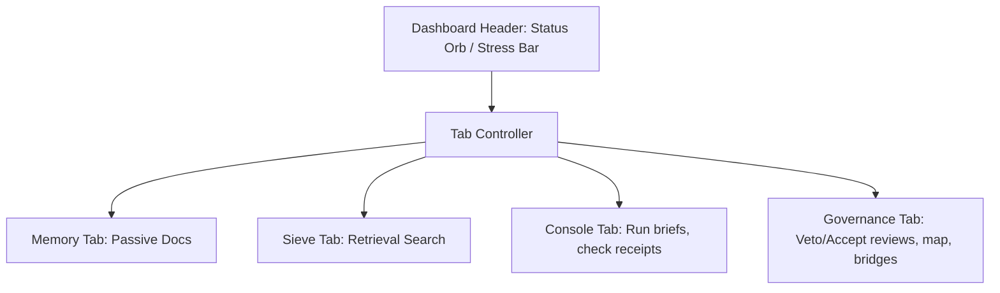

# Dizzy Operator Dashboard: Product Strategy & UX Architecture Critique

**Date:** July 17, 2026  
**Author:** Principal Product Director & Lead UX Architect for AI Safety, Runtime Governance, and Alignment Monitoring Platforms  
**Status:** Strategic Review  

---

## 1. Executive Summary

As AI runtime systems in July 2026 scale in autonomy, the role of the human operator transitions from direct prompt engineering to high-stakes **alignment supervision and runtime governance**. In crisis scenarios—characterized by sudden system drift, capability boundary violations, or multi-agent validation failures—the operator's cognitive capacity degrades due to stress-induced cognitive tunneling. 

The Dizzy Dashboard serves as the primary station for tracking system drift, anomaly detection, and manual override actions. While the recent introduction of the **Stress Bar** and the **Spectral Pulse** represents a major step forward in continuous state visualization, the current tab-isolated panel architecture and keyboard shortcut bindings introduce unnecessary cognitive friction and risk of operator error under pressure.

This report evaluates the Dizzy operator dashboard across five core dimensions, reconciling engineering utility with operator psychology, and outlines a product strategy pivot toward a **Unified Sovereignty Command Station**.

---

## 2. Inquiry Triad Analysis

To ground this strategic critique under conditions of uncertainty and shifting runtime governance models, we address the Inquiry Triad:

### 2.1 What information is missing?
*   **Cognitive Performance Under Stress:** We lack empirical telemetry on operator response times during robust Z-score spikes, error rates when keyboard shortcuts collide with browser defaults, and visual drift patterns under high-density scroll conditions.
*   **Systemic Cause-and-Effect Links:** The telemetry notifies the operator that a Z-score is high or that a node is "high-friction," but it does not link that friction back to the specific offending memory bridge, client brief, or active prompt config.
*   **Cryptographic Attestation Specs:** The dashboard explicitly warns that review states are "reported... not a cryptographic protocol." We lack a specification for migrating these to tamper-proof cryptographic proofs (e.g., zero-knowledge boundary proofs), which limits the dashboard's security posture in zero-trust environments.

### 2.2 What trends might emerge?
*   **Governance-by-Exception:** Human operators will cease monitoring nominal operations. Dashboards must transition from passive telemetry viewers to active alerting and threshold-based auto-containment stations where humans only intervene to resolve multi-agent disputes or override critical vetos.
*   **Multi-Agent Validation Chains:** As validation moves from single-model checks to collaborative chains (e.g., Codex, OpenClaude, Antigravity), disputes between validators will become more frequent and nuanced, requiring visual conflict-resolution workspaces rather than binary status lights.
*   **Haptic and Peripheral Signaling:** High-density command rooms will increasingly leverage preattentive visual cues (like rhythmic pulsing, spatial pressure fields, and sticky tension scales) to bypass the operator's overloaded text-processing centers.

### 2.3 What is changing recently?
*   **Active Containment Over Passive Logging:** Alignment monitoring has evolved from post-hoc audit logging to real-time capability containment (e.g., sandboxed preflights, quarantined memory bridges).
*   **Friction Metaphors:** Visual design is moving away from flat charts toward continuous, organic models of systemic health (e.g., thermodynamic "pressure fields" and oscillation frequency-based status indicators).

---

## 3. Does this solve the right problem for the local operator?

### 3.1 The Alignment Gap: Playground vs. Control Room
The current dashboard suffers from **identity fragmentation**. It is labeled the *"Dizzy Calibration Playground"* and the *"Drift & Epistemic Memory Dashboard."* 
*   **A "Playground"** is optimized for experimentation, low-stakes tweaking, and sequential testing (e.g., running searches in the Sieve, writing test briefs in the console).
*   **A "Control Room"** is optimized for high-stakes governance, rapid threat detection, containment, and override execution.

For a local operator responsible for runtime safety, the playground framing is the wrong problem. The operator is not there to "play" with parameters; they are there to guarantee alignment boundaries are not crossed on local hardware. The dashboard successfully exposes the necessary data layers (memory decay, routing bases, consensus nodes, and quarantine queues), but by packaging them inside a playground structure, it fails to prioritize critical intervention over passive exploration.

### 3.2 The Verification Deficit
The local operator needs to quickly answer: *Is the system executing safely right now, and if not, how do I stop it?*
The current UI exposes logs, receipts, and a consensus map, but it keeps the operator in a passive observation loop:
*   The **Quarantined Memory Bridges** queue waits for manual approval, but there is no notification system that alerts the operator when a critical bridge is pending, nor can they view the active graph context.
*   The **Reported Review State** is decoupled from actual execution controls, meaning the agent can continue running even if the CDX, OCD, and AGV chain has collapsed or is awaiting operator review.

---

## 4. Are there features missing that would change how someone actually uses this?

To move the dashboard from an engineering utility to an operational command center, several critical features are missing:

### 4.1 Automated Containment & Policy Rules
Currently, the operator must manually review and click to "Veto" or "Accept" states. In a fast-moving runtime environment, manual intervention is too slow.
*   **Missing Feature:** An **Automation Policy Engine**. Operators should be able to define rules like: 
    *   *“If robust Z-score exceeds 3.0, automatically freeze memory graph writes and downgrade model routing to an aligned fallback model.”*
    *   *“If CDX and OCD report a capability violation, quarantine the client session immediately.”*

### 4.2 Incident Playback & State Rollback ("Time-Machine")
Systems drift gradually. When the Stress Bar indicates a high-tension state, the operator needs to understand *how* the system reached this point.
*   **Missing Feature:** A **Temporal Scrubber (Log Playback)**. The operator needs to scroll back through historical continuity states, trace logs, and telemetry charts to pinpoint the exact moment of divergence, and then click to **Revert System State** to a prior clean checkpoint.

### 4.3 Root-Cause Diagnostics
When the MDS map shows high-friction consensus nodes, or the simulator logs a large cumulative divergence, the operator has to manually hunt for the cause.
*   **Missing Feature:** **Explainable Drift Callouts**. Hovering over a high-friction node or warning should show a diagnostic card summarizing *why* this node is unstable (e.g., linking it to a recently merged memory document or a specific client input prompt).

### 4.4 Cryptographic Attestation
The warning banner notes that review states are "reported, not a cryptographic protocol."
*   **Missing Feature:** **Cryptographic Proof Validation**. To secure the system against spoofing or compromised agents, the validation chain should display cryptographic signatures, allowing the operator to verify that the CDX, OCD, and AGV nodes are actually authentic, rather than just returning spoofed JSON states.

---

## 5. Is the flow intuitive or does it create friction?

The current HMI layout and navigation architecture introduce significant friction, particularly during anomalous events:

### 5.1 Tabbed Isolation Destroys Situational Awareness
The dashboard is split into four isolated tabs: `Memory Database`, `Sieve Retrieval Tester`, `Operator Console`, and `Governance & Routing`.

Under stress, if the status orb in the header jitters red, the operator must:
1.  Navigate to the **Governance & Routing** tab to see the **Friction Coordinates Map** and **Reported Review State**.
2.  Switch to the **Operator Console** tab to view the active execution trace or execute an override.
3.  Switch to the **Sieve Retrieval Tester** to verify why a document is causing drift.

This tabbed isolation breaks **Level 2 (Comprehension)** and **Level 3 (Projection) Situational Awareness**. The operator is forced to rely on short-term working memory to synthesize data across tabs—which is the first cognitive system to fail under crisis-induced stress.

### 5.2 Keyboard Shortcuts & Accessibility Failures
The current hotkey configuration is highly prone to operational errors:
*   **Alt+E Conflict:** In Windows Chrome/Edge, `Alt+E` is the browser shortcut to open the settings menu. When an operator tries to run an execution or override in a crisis, the browser settings dropdown will overlay the screen, causing immediate panic and disruption.
*   **Alt+R Conflict:** `Alt+R` conflicts with screen recording and system overlays in several operating systems.
*   **Hijacked Tab Key:** Hijacking the `Tab` key to cycle UI tabs prevents keyboard users from navigating input forms (e.g., moving focus from Client ID to Service ID to the Brief textarea). This violates accessibility standards and forces constant, high-friction shifting between keyboard and mouse.
*   **No Hotkeys for Critical Decisions:** There are no keyboard shortcuts bound to the most critical actions: **Accept Reported Review State** and **Reject/Veto State**. Operators must search for and click small buttons with a mouse pointer.

### 5.3 Telemetry Disconnection
*   The **Two-Treasury Fork Simulator** hides its Telemetry Summary Card (`display: none` by default) until the simulation completes. An operator cannot monitor the simulation's progress in real-time, and the detailed trajectory logs are collapsed, hiding valuable divergence insights.

---

## 6. Product Direction Recommendations (The "What", Not the "How")

To transform the Dizzy operator dashboard into a resilient, high-assurance alignment command center, we propose three directional shifts:

### 6.1 Transition to a Pinned, Unified HUD (Heads-Up Display)
Abolish the tabbed navigation model for live operations. Move to a **Unified 3-Zone Control Layout** that brings telemetry, decision-making, and execution controls onto a single, persistent screen.
*   **Zone A (Telemetry & System State):** Left column. Continuously displays the Stress Bar, Spectral Pulse, hardware metrics, model routing basis, and active prompt packs.
*   **Zone B (Decision & Consensus Map):** Center column. Displays the Friction Coordinates Map, Validator Chain Status (CDX, OCD, AGV), and the Operator override controls (Veto/Accept).
*   **Zone C (Console & Logs):** Right column. Houses the Execution Console, dynamic capability receipts, and scrolling trace logs.

*Benefit:* Eliminates short-term memory dependency, ensuring the operator has full context at a glance before taking corrective actions.

### 6.2 Implement Policy-Based Automation & Containment
Introduce a safety policy editor. Instead of requiring manual operators to approve or veto every state transition, the system should allow setting rules that automatically trigger containment protocols (e.g., auto-veto, routing downgrade, sandbox freeze) based on telemetry thresholds.

### 6.3 Standardize on Zero-Trust Cryptographic Proofs
Upgrade the verification framework from passive "reported" states to verified cryptographic attestations. Every boundary crossing, memory write, and agent routing decision must yield a cryptographically signed receipt that the dashboard validates in real-time, ensuring security against hostile or compromised runtimes.

---

## 7. Implementation & UX Architecture Adjustments (The "How")

To implement these strategic recommendations in the codebase (`index.html` and `dashboard.js`) while maintaining performance and zero-dependency compliance:

### 7.1 Unified 3-Zone Command Layout
Refactor the grid layout in `index.html` from a single-column card set to a persistent three-column HUD on screens $> 1200\text{px}$:

```
+---------------------------------------------------------------------------------+
| [Orb] DIZZY CONTROL STATION  | === STRESS BAR [|||||||||......] Z: 2.10 | [Ctrl+R] |
+------------------------------+----------------------------------+---------------+
| ZONE A: TELEMETRY & SYSTEM   | ZONE B: DECISION & SPACE MAP     | ZONE C: CONSOLE|
|                              |                                  |               |
| * Friction Anomaly Status    | * Pluralistic Options Map        | * Execute     |
|   MAD Z-Score Indicator      |   (Radial Pressure Gradients)    |   Client ID   |
|                              |                                  |   Service ID  |
| * Spectral Pulse Indicator   | * Validator Chain Status         |   Brief Input |
|                              |   [CDX] -> [OCD] -> [AGV]        |               |
| * Telemetry Summary Card     |                                  | * Trace Logs  |
|   (Avg / Peak Divergence)    | * Operator Signoff Controls      |   Real-time   |
|                              |   [Ctrl+Enter] Accept            |   JSON output |
| * Quarantined Bridges Queue  |   [Ctrl+Backspace] Veto          |               |
|                              |                                  | * Receipt Grid|
|                              |                                  |   (Iconic)    |
+------------------------------+----------------------------------+---------------+
| Shortcut Hint Bar: [Ctrl+R] Refresh | [Ctrl+Enter] Signoff | [Ctrl+Backspace] Veto |
+---------------------------------------------------------------------------------+
```

### 7.2 Non-Conflicting Keyboard shortcuts & Focus Restoration
*   **Remove browser-conflicting hotkeys:** Eliminate all `Alt` key combinations.
*   **Restore Tab Navigation:** Remove `e.preventDefault()` on the `Tab` key event so operators can standardly tab through console input fields.
*   **Implement Safe, Direct Hotkeys:**
    *   `Ctrl+R`: Soft-reload all telemetry and records without reloading the browser page.
    *   `Ctrl+Enter`: Execute/Run the Console brief (if focused in Console) OR Accept the Reported Review State (if focused in Governance).
    *   `Ctrl+Backspace`: Trigger Veto/Override of the Reported Review State.
    *   `Ctrl+Shift+P`: Prune expired continuity records.
*   **Flash Feedback:** Retain the keyboard hint cap flashing animation in the header to visually confirm hotkey registration.

### 7.3 Visual Signaling Enhancements
*   **Sticky Header HUD:** Pin the header using CSS sticky layout:
    ```css
    header {
      position: sticky;
      top: 0;
      z-index: 1000;
      backdrop-filter: blur(12px);
      -webkit-backdrop-filter: blur(12px);
      background: rgba(8, 12, 20, 0.85);
      border-bottom: 1px solid var(--border-color);
    }
    ```
*   **Expanded Stress Bar with $3\sigma$ Warning Line:** Increase height to `6px` and add a background gutter with a red vertical threshold tick at the 60% mark (Z-score 3.0 out of 5.0) to give an immediate preattentive baseline:
    ```css
    .stress-bar-container {
      position: absolute;
      bottom: 0;
      left: 0;
      width: 100%;
      height: 6px;
      background: rgba(255, 255, 255, 0.05);
      z-index: 5;
    }
    .stress-bar-container::before {
      content: "";
      position: absolute;
      top: 0;
      left: 60%; /* 3.0 / 5.0 maximum */
      width: 2px;
      height: 100%;
      background: rgba(244, 63, 94, 0.6);
      z-index: 6;
    }
    ```
*   **Spectral Pulse Optimization:** Ensure the status orb has `will-change: transform, opacity` and animate scale and opacity rather than brightness/blur to avoid GPU repaint storms.

### 7.4 Iconic Capability Grid
Refactor the text-based summary in `renderReceiptSummary()` into a grid of visual badges with micro-icon status states:
```javascript
function renderCapabilityGrid(receipt) {
  const caps = [
    { name: "Repo", allowed: receipt.repo_retrieval_allowed, icon: "folder" },
    { name: "Memory", allowed: receipt.durable_memory_allowed, icon: "database" },
    { name: "Private", allowed: !receipt.private_memory_access, icon: "shield-lock" }
  ];
  return `
    <div class="capability-grid">
      ${caps.map(c => `
        <div class="cap-icon cap-icon--${c.allowed ? 'allowed' : 'blocked'}" 
             title="${c.name}: ${c.allowed ? 'ALLOWED' : 'BLOCKED'}" 
             tabindex="0">
             <!-- Embedded inline SVG based on icon state -->
             <span class="sr-only">${c.name} ${c.allowed ? 'Allowed' : 'Blocked'}</span>
        </div>
      `).join('')}
    </div>
  `;
}
```

### 7.5 MDS Map Edge Cases
Add validation guards inside `updateMDSPressure` to handle extreme cases safely:
```javascript
function updateMDSPressure(nodes) {
  const container = document.getElementById('coordinate-map');
  if (!container) return;

  // Edge Case 1: Empty node list (neutral state)
  if (!nodes || nodes.length === 0) {
    container.style.setProperty('--pressure-color', 'hsla(180, 0%, 55%, 0.15)');
    return;
  }

  const frictionMap = { low: 0.1, medium: 0.5, high: 0.9 };
  const totalWeight = nodes.reduce((sum, n) => sum + (frictionMap[n.friction] || 0.2), 0);
  const avgFriction = totalWeight / nodes.length;

  // Edge Case 2: Extreme high friction clamp to 300° magenta to avoid visual blow-out
  const hue = Math.min(300, 120 + avgFriction * 180);
  const cssVar = `hsla(${hue}, 70%, 55%, 0.15)`;
  container.style.setProperty('--pressure-color', cssVar);
}
```

---

## 8. Summary Comparison Matrix

| UX Element | Current Design | Proposed Design | Cognitive & Operational Benefit |
| :--- | :--- | :--- | :--- |
| **Workspace Layout** | Tabbed isolation (4 separate tabs) | **Unified 3-Zone HUD** | Eliminates short-term memory dependencies; maintains situational awareness. |
| **Stress Bar** | 3px base height, no visual reference scale | **6px height with $3\sigma$ redline boundary** | Leverages preattentive comparison to gauge crisis proximity. |
| **Spectral Pulse** | Top-right relative position | **Sticky Header placement (pinned)** | Continuous peripheral threat feedback regardless of scroll depth. |
| **Keyboard Navigation** | Hijacked `Tab` key, browser-conflicting hotkeys | **Restored Tab focus, Ctrl+Key override bindings** | Prevents accidental browser settings trigger; allows keyboard-only form entry. |
| **Emergency Actions** | Click-only Veto/Signoff buttons | **Hotkeys (`Ctrl+Backspace` / `Ctrl+Enter`)** | Enables split-second manual containment overrides. |
| **Boundary Telemetry** | Text-heavy lists | **Icon-based Capability Grid** | Reduces scanning time from seconds to milliseconds. |
