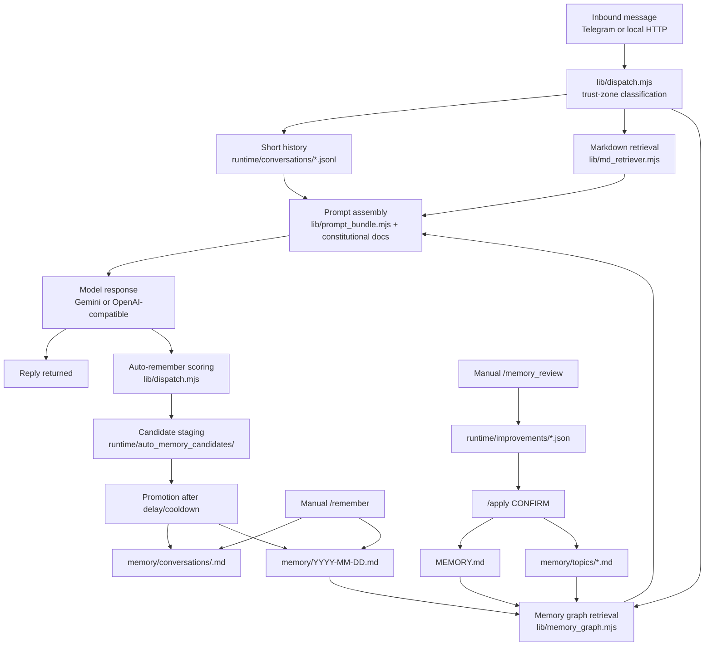
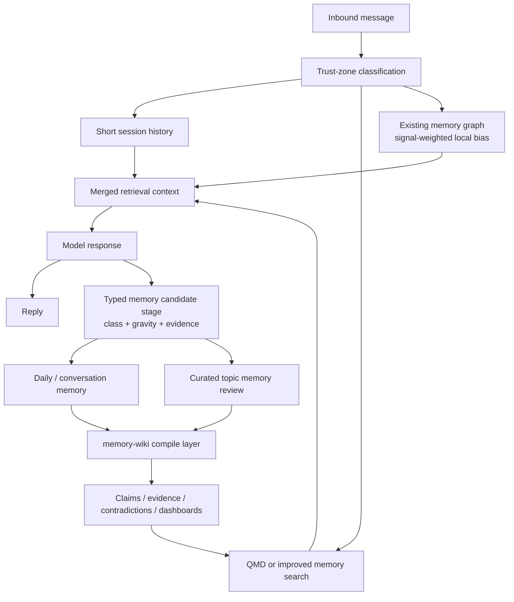

# Current Memory Flow

Date: 2026-04-21

Purpose: show the current local memory pipeline and where OpenClaw-native upgrades would slot in.

## Current flow

## What the current system already does well

- trust-zone aware continuity boundaries
- local-first file-based memory
- explicit curation path for durable memory
- simple, inspectable retrieval logic
- memory graph tuned to repo-specific concepts like autonomy, structure, meaning, and decisions

## Main weaknesses in the current flow

- retrieval quality is capped by a small corpus and lightweight ranking
- memory graph has no strong provenance model
- remembered output is prose-shaped, not typed memory objects
- no contradiction layer
- no freshness / decay layer
- no compiled belief surface above the raw Markdown files

## Best OpenClaw-native insertion points

### 1. QMD at retrieval

Best location:

- between stored memory files and the retrieval step now handled by `md_retriever` plus the memory graph

Practical effect:

- stronger semantic recall
- reranking
- duplicate suppression
- optional indexing of extra corpora

Potential role:

- keep the current memory graph for repo-shaped signals
- let QMD handle broader recall and ranking

## Suggested hybrid

- QMD for broad recall
- existing memory graph for domain-weighted signal bias

### 2. `memory-wiki` above durable memory

Best location:

- above `MEMORY.md` and `memory/topics/*.md`

Practical effect:

- claims
- evidence
- contradiction tracking
- dashboards
- compiled digest

Potential role:

- raw memory remains human-readable Markdown
- wiki layer becomes the provenance-rich synthesis surface

### 3. Memory search tuning at ranking

Best location:

- wherever the future retrieval layer merges candidate results

Most relevant toggles:

- MMR
- temporal decay
- hybrid lexical + semantic ranking

Practical effect:

- less stale retrieval
- fewer duplicate snippets
- better top-k quality as memory grows

### 4. Gravity-well schema at candidate generation

Best location:

- current auto-remember and memory-review candidate stage

Practical effect:

- remembered items gain class, gravity, source type, and evidence strength
- unusual but grounded content is less likely to be silently flattened

## Recommended staged target flow

## What should probably remain custom

Not everything should be replaced.

Most likely keep:

- trust-zone logic in `dispatch.mjs`
- repo-specific signal groups in the memory graph
- cautious apply-confirm memory review workflow

Those are domain-shaped advantages, not obvious redundancy.

## What should probably be upgraded first

1. retrieval quality
2. provenance layer
3. typed memory candidates

That order matches the actual current bottlenecks.
